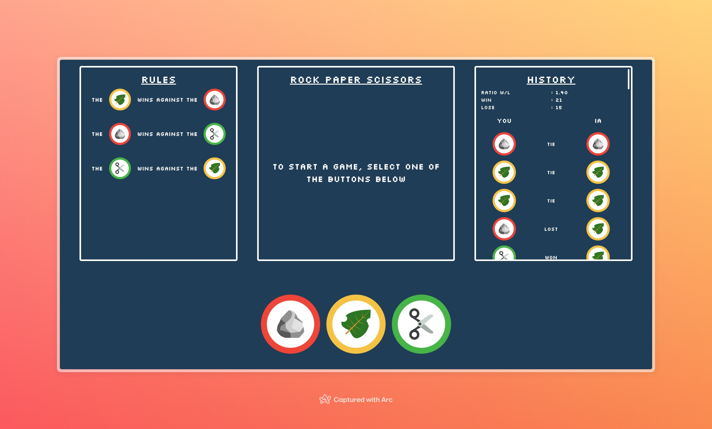

# Rock Paper Scissors

This project is a small website for playing rock paper scissors against the computer.

This project was created with [tailwindcss](https://tailwindcss.com/), [React](https://react.dev/) and [Next.js](https://nextjs.org/).

To start the site, use the command

```bash
npm run dev
```

And access the url [http://localhost:3000](http://localhost:3000) with your browser to see the result or open [rock-paper-scissors](https://rock-paper-scissors-swart-theta.vercel.app)



# Add new rules

To add new rules add elements like this to the [rules.tsx](./app/[lang]/utils/rules.tsx) file :

```typescript
import newElemImage from 'url/newElemImage.svg

'elemName': {
	name: 'elemName',
	color: '#000', /* Color for border of circle image */
	image: newElemImage,
	win: [table containing all the other elements against which it can win],
},
```
